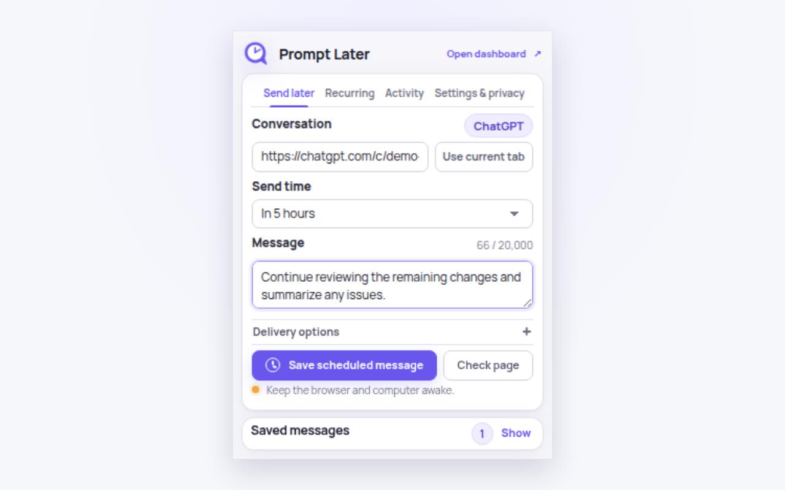

# Prompt Later

[](https://github.com/IceyFoxes/prompt-later/actions/workflows/ci.yml)
[](LICENSE)

Prompt Later is a Chrome extension for scheduling messages in existing AI chat conversations. It supports one-time and recurring schedules, keeps its data on your device, and sends through the provider website using your existing signed-in session.



## Features

- Schedule a message once or repeat it every few hours, daily, on weekdays, or with a five-field cron expression.
- Capture the current conversation or paste a conversation URL.
- Pause and edit jobs, and review recent delivery activity.
- Preserve, send, or replace an existing composer draft before a scheduled delivery.
- Store messages, target URLs, schedules, and activity locally with AES-256-GCM encryption.
- Request access only to provider sites you choose—there are no broad mandatory host permissions.
- Run without a Prompt Later account, extension backend, telemetry, or AI API key.

ChatGPT and Claude are supported. Devin, Gemini, DeepSeek, Kimi, Perplexity, Microsoft Copilot, Qwen, and Mistral Le Chat are experimental because provider-page changes can break their integrations.

## Important limitations

Prompt Later automates provider webpages; it does not use provider APIs. The browser must be running, the computer must be awake, and the provider session must still be signed in when a message is due. Browser alarms may run late, and website or account changes can prevent delivery.

A **Sent** result means that the webpage acknowledged the message. It does not guarantee that the provider completed a response. Prompt Later does not bypass provider quotas or usage limits.

## Install from source

You need Chrome 120 or newer, Node.js 24, and Python 3.

```sh
git clone https://github.com/IceyFoxes/prompt-later.git
cd prompt-later
npm ci
npm run build
```

Then open `chrome://extensions`, enable **Developer mode**, choose **Load unpacked**, and select the generated `dist` directory.

## Development

```sh
# Build the unpacked extension
npm run build

# Run unit tests
npm run test:unit

# Install the browser used by the end-to-end tests
npx playwright install chromium

# Run the complete test suite
npm test

# Produce release/prompt-later.zip
npm run package
```

The main source lives in `src/`. Static UI files and the bundled font live in `static/`; store copy and artwork live in `store/`. Builds are written to `dist/` and release archives to `release/`. Both output directories are ignored by Git.

## Privacy and security

Scheduled content is encrypted in local extension storage using a non-exportable browser-held device key. Plaintext still exists in memory when the extension displays or sends a message, and anyone controlling an unlocked browser profile may be able to access it. The vault is local to one browser profile and is not synchronized by Prompt Later.

The extension inspects only the selected provider page as needed to find the composer, protect existing drafts, send configured text, and confirm acknowledgement. It does not store conversation transcripts or model responses. See the [full privacy policy](https://iceyfoxes.github.io/prompt-later-site/privacy.html) for the data-handling details.

Please do not include private prompts, credentials, cookies, or other sensitive data in public bug reports. Security concerns can be sent privately to [promptlater.support@gmail.com](mailto:promptlater.support@gmail.com).

## Contributing

Bug reports and focused pull requests are welcome. Before submitting a change:

1. Keep permissions scoped to the extension's single scheduling purpose.
2. Add or update tests for behavioral changes.
3. Run `npm test` and `npm run package`.
4. Clearly identify experimental provider support and user-visible reliability limits.

## License

Prompt Later is free software licensed under the [GNU General Public License v3.0 only](LICENSE).

The bundled Manrope font is licensed separately under the [SIL Open Font License 1.1](static/fonts/OFL.txt). Third-party dependencies retain their respective licenses.

Prompt Later is an independent project and is not affiliated with any supported AI provider.
